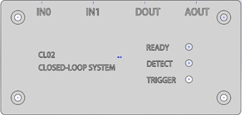
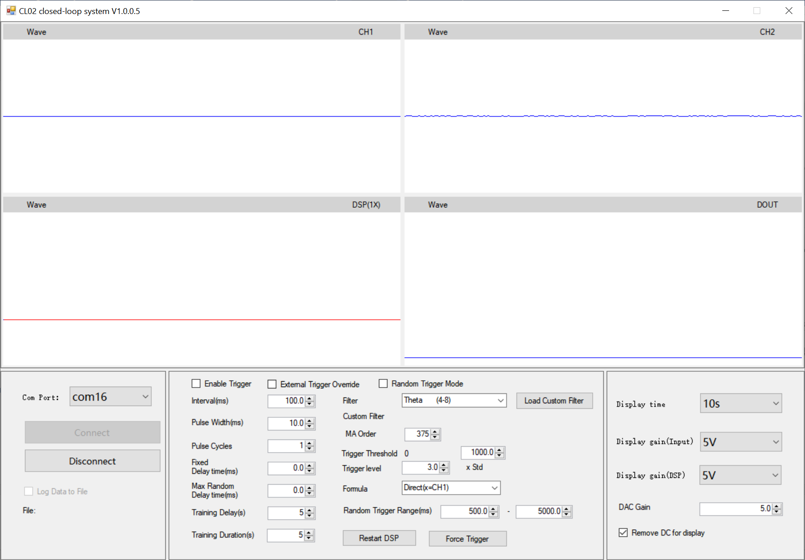

---
hide:
  - navigation
  - toc
---

<section class="cl02-hero">
  

    <h1>A compact closed-loop controller for LFP-triggered stimulation</h1>
    
CL02 detects configured local-field-potential oscillation features from analog inputs and drives timed trigger outputs for closed-loop electrophysiology experiments.

    

      <a class="md-button md-button--primary" href="getting-started/">Get Started</a>
      <a class="md-button" href="hardware/">Hardware</a>
      <a class="md-button" href="software/">Software</a>
      <a class="md-button" href="firmware-analysis/">Firmware</a>
      <a class="md-button" href="https://github.com/zifangzhao/CL02_closedloop_systems">GitHub</a>
    

    

      IN0 and IN1 analog inputs
      DOUT trigger output
      AOUT analog output
      1 kHz DSP workflow
      Windows control center
    

  

  

    <figure class="cl02-hero-tile cl02-device-tile">
      
      <figcaption class="cl02-caption">The CL02 front panel exposes two analog inputs, digital and analog outputs, and three state indicators for closed-loop readiness and trigger state.</figcaption>
    </figure>
    <figure class="cl02-hero-tile cl02-ui-tile">
      
    </figure>
  

</section>

<section class="cl02-section">
  

    

      <h2>Current Public Workflow</h2>
      
<strong>Stable public scope:</strong> connect the CL02 device over USB, configure filters and trigger timing in the Windows control center, and use DOUT or AOUT to drive downstream stimulation hardware.

    

    

      <h2>Release Record</h2>
      
Record the installer file, firmware image, PCB revision, filter file, stimulus timing parameters, and threshold settings with each experiment so trigger behavior remains reproducible.

    

  

  

    

      <h3>Run a first bench test</h3>
      
<a href="getting-started/installation/">Install</a> -> <a href="getting-started/first-run/">connect</a> -> configure a conservative trigger -> verify DOUT timing.

    

    

      <h3>Prepare hardware</h3>
      
<a href="hardware/connections-indicators/">Connection map</a> -> status indicators -> stimulator input checks -> PCB revision notes.

    

    

      <h3>Tune detection</h3>
      
<a href="software/filters/">Filter choice</a> -> moving-average order -> baseline training window -> threshold or trigger-level setting.

    

    

      <h3>Update firmware</h3>
      
<a href="getting-started/firmware-update/">DFU mode</a> -> choose a repository firmware image -> upgrade -> return the switch to Run mode.

    

  

</section>

<section class="cl02-section">
  <h2>Closed-Loop Signal Path</h2>
  
CL02 routes analog input through configured filtering and trigger control before asserting the stimulation output.

  

    
Analog input

    
DSP filter

    
Envelope or metric

    
Baseline training

    
Threshold test

    
DOUT or AOUT

  

</section>

<section class="cl02-section">
  <h2>Interface and I/O Summary</h2>
  

    <table class="cl02-spec-table">
      <thead>
        <tr>
          <th>Signal or control</th>
          <th>Public behavior</th>
          <th>Documentation entry</th>
        </tr>
      </thead>
      <tbody>
        <tr><td>IN0</td><td>Analog input 0, 0-3.3 V, configurable with +1.5 V offset.</td><td><a href="hardware/connections-indicators/">Connections</a></td></tr>
        <tr><td>IN1</td><td>Analog input 1, 0-3.3 V, configurable with +1.5 V offset.</td><td><a href="hardware/connections-indicators/">Connections</a></td></tr>
        <tr><td>DOUT</td><td>Digital trigger output, 0-3.3 V.</td><td><a href="software/trigger-logic/">Trigger Logic</a></td></tr>
        <tr><td>AOUT</td><td>Analog output, 0-3.3 V.</td><td><a href="hardware/connections-indicators/">Connections</a></td></tr>
        <tr><td>Ready</td><td>Closed-loop processor state: slow blink while waiting, fast blink while estimating baseline, on when ready.</td><td><a href="hardware/connections-indicators/">Indicators</a></td></tr>
        <tr><td>Detect</td><td>Indicates that a trigger condition is armed; DOUT behavior still depends on stimulator settings.</td><td><a href="hardware/connections-indicators/">Indicators</a></td></tr>
        <tr><td>Trigger</td><td>Indicates DOUT state.</td><td><a href="hardware/connections-indicators/">Indicators</a></td></tr>
      </tbody>
    </table>
  

</section>

<section class="cl02-section">
  <h2>Operator Controls</h2>
  
The Windows control center presents waveform preview, serial connection, trigger timing, DSP filter selection, and display scaling in one bench-facing interface.

  

    

      <h3>Connection</h3>
      
Choose the COM port, connect to the device, and optionally log data to a file during preview.

    

    

      <h3>Trigger timing</h3>
      
Set interval, pulse width, pulse cycles, fixed delay, random delay, and training delay or duration.

    

    

      <h3>DSP configuration</h3>
      
Select filter, formula, moving-average order, trigger threshold, trigger level, and optional custom filters.

    

    

      <h3>Manual checks</h3>
      
Restart DSP or force a trigger during bench validation before moving to experiment hardware.

    

    

      <h3>External override</h3>
      
Read an int32 control value from <code>d:\cl02_control.bin</code> to mask DOUT in the experimental override workflow.

    

    

      <h3>Display scaling</h3>
      
Select display time, input gain, DSP gain, DAC gain, and optional DC removal for waveform review.

    

  

</section>

<section class="cl02-section">
  <h2>System Overview</h2>
  
A typical session starts with a bench connection, then moves through filter selection, baseline training, trigger verification, and experiment logging.

  <figure class="cl02-image-frame">
    
  </figure>
</section>

<section class="cl02-section">
  <h2>Quick Start</h2>
  

    

      <h3>Install software</h3>
      
Use the installer under <code>Windows</code> and install the CL02 USB driver manually if Windows does not bind a usable COM port.

    

    

      <h3>Connect hardware</h3>
      
Wire IN0 or IN1, connect DOUT or AOUT to the downstream device, and confirm voltage compatibility before enabling triggers.

    

    

      <h3>Train and trigger</h3>
      
Select filter, moving-average order, training window, threshold, interval, pulse width, and delay before enabling output.

    

    

      <h3>Save a record</h3>
      
Log the installer version, firmware file, trigger settings, filter file, and hardware connections used for the run.

    

  

</section>
